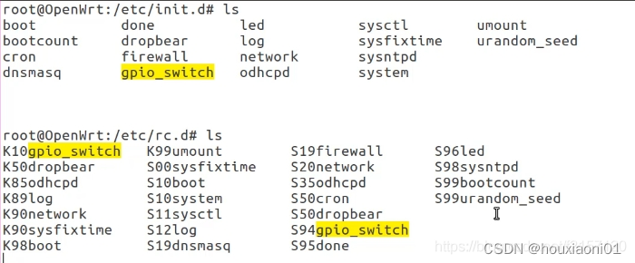
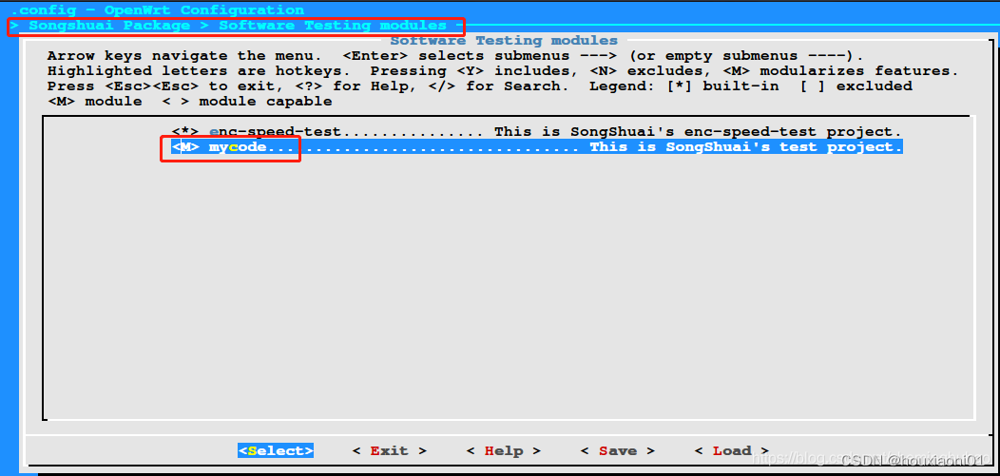
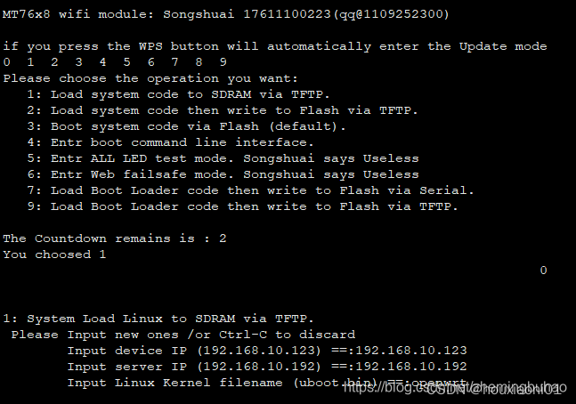
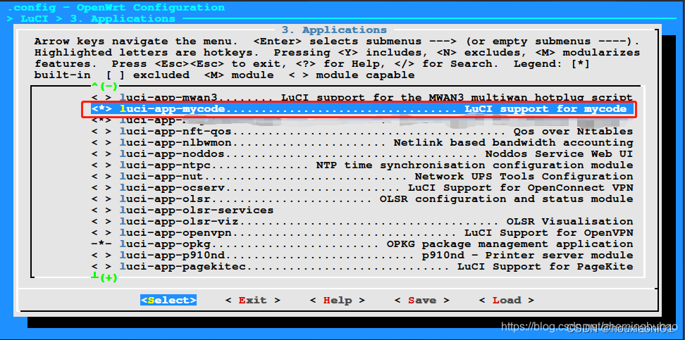
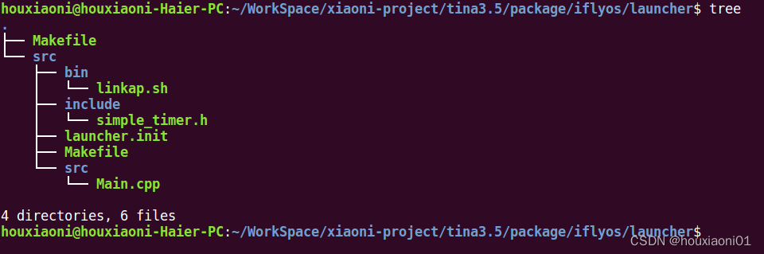
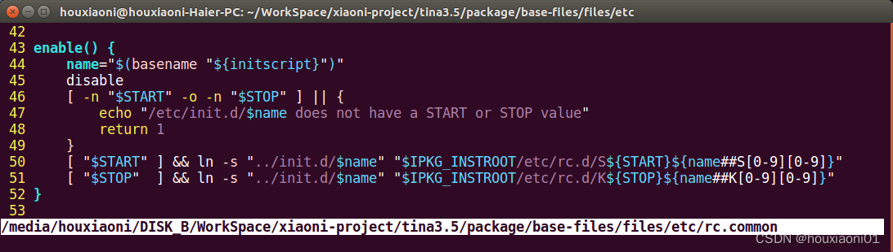
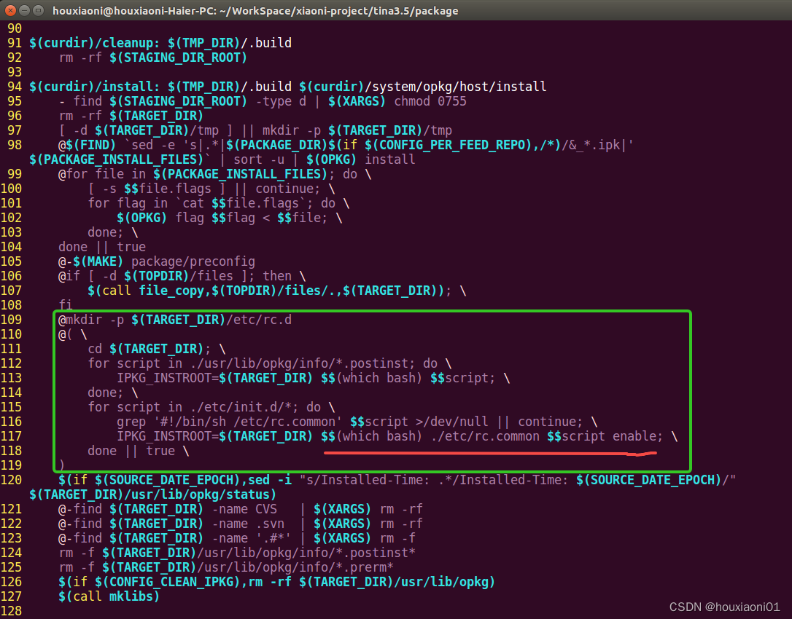

# OpenWRT 学习笔记 -- 用户自定义添加app的开机自启动

参考自：[OpenWRT编译 – 用户自定义添加app的开机自启动](https://blog.csdn.net/songshuai0223/article/details/103944625)
　　　　[OpenWRT 学习笔记-19 OpenWRT开机自启动服务](https://blog.csdn.net/f2157120/article/details/118793847)

## 一、概述 ##

OpenWRT开机自启动服务通过 procd 来管理，ubuntu通过systemd管理。

> 通常的嵌入式系统均有一个守护进程，该守护进程监控系统进程的状态，如果某些系统进程异常退出，将再次启动这些进程。procd 就是这样一个进程，它是使用C语言编写的，一个新的 OpenWrt 进程管理服务。它通过 init 脚本来将进程信息加入到 procd 的数据库中来管理进程启动，这是通过ubus总线调用来实现，可以防止进程的重复启动调用。

OpenWrt开机启动服务实现和普通Linux发行版并无明显差异，基本上就是 /etc/init.d 和 /etc/rc.d 两个目录在起关键作用。/etc/init.d目录存放的是 所有的开机启动脚本（包含启动和未启用的服务），/etc/rc.d 存放的是 启用的（Enabled）开机启动脚本。只有 enabled 的 service 才可以通过软链接放到/etc/rc.d。



服务的启用和禁用可以通过 service enable/disable 命令来实现。

1、在 openwrt 系统内 init 进程被 procd 取代，procd作为父进程可以监控子进程的状态。一旦子进程退出后即可在某一个时刻尝试进行重启进程。

2、如果应用软件需要在 boot 时自动运行，则需要在 /etc/init.d 中增加相应的脚本文件。脚本文件需要 START 参数， 说明在 boot 时的优先级， 如果在 boot 过程启动后再关闭， 则需要进一步设置 STOP 参数。如果 STOP 参数存在， 其值必须大于 START。

3、脚本文件需要 start() 和 stop() 两个函数，start() 是执行程序， stop() 是关闭程序。当存在 boot() 方法时, 系统启动时会调用 boot() 而不是 start()。

4、由 /etc/rc.d/S10boot 知道，装载內核驱动模块的优先级为 10，需要使用自己设计的內核驱动模块的程序其 START 的值必须大于 10。

5、同样由 /etc/rc.d/S40network 知道， 使用网络通信的程序其 START 的值必须大于 40。

## 二、自启动实现方式一 ##

在原来的app应用程序的基础上实现自启动，详见：【OpenWRT编译 – 添加用户自定义app】

**1、package/myapp/目录下创建一个目录 root/，用来存放启动脚本**

    $ mkdir package/myapp/root

然后在 package/myapp/root/ 目录下创建procd启动脚本文件 mycode，其内容如下：

```
#!/bin/sh /etc/rc.common

# Copyright (C) 2006-2011 OpenWrt.org

START=90 # 启动的顺序，越大越靠后，按照字符串顺序排序并不是数字排序。START=90 代表该脚本的启动顺序为90（注意，不是第90个执行的脚本，而是一个级别）。（数字越小，启动的越早）
STOP=92 # 停止的顺序, 越小越靠前
USE_PROCD=1 # 声明使用procd启动
SERVICE=app
PROG=/app/mycode

# start_service 函数必须要重新定义

start_service()
{
    echo service mycode start
    procd_open_instance  # 创建一个实例， 在 procd 看来一个应用程序可以多个实例
    # ubus call service list 可以查看实例
    procd_set_param command $PROG # mycode执行的命令是"/app/mycode" 
    procd_append_param command para1 # 启动参数的追加，如果有多个参数可以对此追加
    procd_append_param command para2 # 启动参数的追加，如果有多个参数可以对此追加
    procd_set_param respawn # 定义respawn参数，告知procd当mycode程序退出后尝试进行重启
    procd_close_instance # 关闭实例
}

# service_triggers 重新定义，没有操作那么可以删掉，但是不能为空

service_triggers()
{
    procd_add_reload_trigger mycode
}
#reload_service重新定义，没有操作那么可以删掉，但是不能为空
reload_service()
{
    echo service mycode reload
}

# stop_service重新定义，退出服务后需要做的操作，没有操作那么可以删掉，但是不能为空

stop_service()
{
    echo service mycode stop
}
#restart重新定义，没有操作那么可以删掉，但是不能为空
restart() 
{
    stop
    start
}
```

脚本分析：

- #!/bin/sh /etc/rc.common

固定在第一行，指定了执行该脚本的方式（必须），shebang #! 使用 /bin/sh 作为脚本解释器，/etc/rc.common 作为启动脚本执行前的检查脚本，可以检测出非法的参数。其实就是将整个shell的控制权交到了 /etc/rc.comon 这个脚本，从第2行开始的所有shell语句只能被动地被 rc.common 中的语句所调用。例如该脚本名为 mycode，如果执行命令为 mycode parameters，即为运行 /etc/rc.common mycode parameters。

从上可以看出，script本身并不解析命令行参数，而是由/etc/rc.common来完成。

- START= 和 STOP=

决定脚本启动时的次序。启动时 init.d 会根据文件名顺序，自动执行在/etc/rc.d中找到的脚本，初始化脚本可以作为/etc/init.d/下文件的软链放置在/etc/rc.d/。

enable 和 disable 可以自动帮你创建对应的带序号的软链接。通过/etc/init.d/<name> enable/disable可以启用或禁止模块的初始化脚本（或称启用/禁止开机自启动），它是通过创建或删除/etc/rc.d中S??和K??开头的符号链接来完成的，而这些符号链接是 /etc/init.d/rcS 在启动阶段处理。

这个例子中START=90 会被链接到 /etc/rc.d/S90mycode，启动时执行在START=89之后，在START=91之前；而STOP=92会被链接到 /etc/rc.d/K92mycode，执行在STOP=91之后，在STOP=93之前；同一个启动数字的，按字母顺序启动。

- USE_PROCD=1

表示使用procd来管理进程。​​​​​​​如果在自己的启动脚本中定义了USE_PROCD，那就需要调用procd预定义的函数，即调用start_service、stop_service和 reload_service函数等。在rc.common中对start、stop 和 reload函数进行了重新定义，在调用这些函数时，将调用start_service、stop_service和 reload_service函数等，相当于重载了这些函数。

- PROG=

PROG变量用来给程序的启动脚本赋值，用于启动应用程序。

- start_service()

向 procd 注册并启动服务，是将在 services 所管理对象里面增加了一项。如果自己的应用程序没有配置文件，只要实现 start_service() 就好。

procd_open_instance 开始增加一个服务实例。

procd_set_param 设置服务实例的参数值，通常会有以下几种类型的参数。

command：服务的启动命令行。
respawn：进程意外退出的重启机制及策略，它需要有 3 个设置值。第一个设置为判断异常失败边界值（threshold），默认为3600秒，如果小于这个时间退出，则会累加重新启动次数，如果大于这个临界值，则将重启次数置 0。第二个设置为重启延迟时间（timeout），将在多少秒后启动进程，默认为5秒。第三个设置是总的失败重启次数（retry），是进程永久退出之前的重新启动次数，超过这个次数进程退出之后将不会再启动。默认为 5 次。也可以不带任何设置，那这些设置都是默认值。
env：进程的环境变量。
file：配置文件名，比较其文件内容是否改变。
netdev：绑定的网络设备（探测 ifindex 更改）。
limits：进程资源限制。

每次只能使用一种类型参数，其后是这个类型参数的值。

procd_close_instance 完成进程实例的增加。

- stop_service()

让 procd 解除注册，并关闭服务, 是将在 services 中的管理对象删除。这个是procd kill自己的应用程序后调用的，若果你的应用程序关掉后，需要一些清理工作，需要实现这个。

- service_triggers()

配置文件或网络接口改变之后触发服务重新读取配置。如果自己的应用需要关联一个配置文件test，（需要放在 /etc/config/ 目录下），可以跟踪文件的修改情况，如果这个文件有改变，就调用 service_triggers()。在 service_triggers 也可以添加跟踪网络的修改，也可以同时跟踪多个配置文件。

procd_add_reload_trigger 增加配置文件触发器，每次配置文件的修改，如果调用了reload_config时，当前实例都被重启。有一个可选的参数为配置文件名称。其实它在内部是调用procd_open_trigger、procd_add_config_trigger和procd_close_trigger这3个函数来增加触发器。

- reload_service()

重启服务，如果定义了该函数，在 reload 时将调用该函数，否则再次调用 start 函数。配置文件改变后，需要调用这个函数，可以根据自己需要实现功能。

- restart()

重启服务，stop 停止服务，start 启动服务。

> 注：start和reload区别是
> start：一般是指应用程序启动；
> reload：一般是指只是重新加载与配置文件改变相关的部分，不把整个应用程序重新启动。

备注： 在执行该启动脚本时，如果需要对procd脚本进行调试，可以设置PROCD_DEBUG变量为 1，这样可以输出向ubus总线调用的参数信息。

**2、然后修改 package/myapp/Makefile**

修改后的 Makefile 如下所示：

```
##############################################

# 

# OpenWrt Makefile for mycode program

# 

##############################################
include $(TOPDIR)/rules.mk
include $(INCLUDE_DIR)/kernel.mk

PKG_NAME := mycode
PKG_VERSION := 0.1
PKG_RELEASE := 1
PKG_BUILD_DIR := $(BUILD_DIR)/$(PKG_NAME)

include $(INCLUDE_DIR)/package.mk

define Package/$(PKG_NAME)
  SECTION:=utils
  CATEGORY:=Songshuai Package
  SUBMENU:=Software Testing modules
  TITLE:=This is SongShuai's test project.
  MAINTAINER:=Songshuai
endef

define Package/$(PKG_NAME)/description
    If you can't figure out what this program does, you're probably
    brain-dead and need immediate medical attention.
endef

define Build/Prepare
    mkdir -p $(PKG_BUILD_DIR)
    $(CP) ./src/* $(PKG_BUILD_DIR)/
endef

define Build/Configure
endef

define Build/Compile
    $(MAKE) -C $(PKG_BUILD_DIR) \
        ARCH="$(LINUX_KARCH)" \
        CC="$(TARGET_CC)" \
        CFLAGS="$(TARGET_CFLAGS) -Wall" \
        LDFLAGS="$(TARGET_LDFLAGS)"
endef

define Package/$(PKG_NAME)/install
    $(INSTALL_DIR) $(1)/app $(1)/etc/init.d/
    $(INSTALL_BIN) $(PKG_BUILD_DIR)/$(PKG_NAME) $(1)/app/
    $(INSTALL_BIN) ./root/mycode $(1)/etc/init.d/   # 此时需要安装脚本到要制作的根文件系统中，这样执行权限也就有了
endef

define Package/$(PKG_NAME)/preinst
    #!/bin/bash
    echo 'installing $(PKG_NAME)'
endef

define Package/$(PKG_NAME)/postinst
    #!/bin/sh
    # check if we are on real system
    if [ -z "$${IPKG_INSTROOT}" ]; then
        echo "Enabling rc.d symlink for $(PKG_NAME)"
        /etc/init.d/mycode enable
    fi

    echo '$(PKG_NAME) installed successed !'
    exit 0

endef

define Package/$(PKG_NAME)/prerm
    #!/bin/sh
    # check if we are on real system
    if [ -z "$${IPKG_INSTROOT}" ]; then
        echo "Removing rc.d symlink for $(PKG_NAME)"
        /etc/init.d/mycode disable
    fi
    echo 'removeing $(PKG_NAME)'
    exit 0
endef

define Package/$(PKG_NAME)/postrm
    #!/bin/bash
    echo '$(PKG_NAME) remove successed !'
endef

$(eval $(call BuildPackage,$(PKG_NAME)))
```

使用 xxx enable 使得脚本开机自启动。其中，xxx为前面编写的脚本文件名。
xxx enable 的命令实质上是为脚本文件创建一个软链接，软链接存放于/etc/rc.d/下，如果我们不想使用 rc.common 的 enable 命令也可以，我们可以自己创建链接。

**3、make menuconfig**



还是将 mycode 软件包配置成 ipk 模块。

**4、单独编译**

    $ make package/mycode/compile V=99

**5、将生成的 ipk 软件包下载到目标设备并通过 opkg 安装，程序会自动启动并运行**

```
# opkg install mycode_0.1-1_mipsel_24kc.ipk

Installing mycode (0.1-1) to root...
installing mycode
Configuring mycode.
Enabling rc.d symlink for mycode
mycode installed successed !
service mycode start
[ 00 ] This is /dev/console Test
[ 01 ] This is /dev/console Test
[ 02 ] This is /dev/console Test
...
```

**6、卸载可以使用指令**

```
# opkg remove mycode

Removing package mycode from root...
Removing rc.d symlink for mycode
removeing mycode
service mycode stop
mycode remove successed !
```

在程序运行过程中，可以使用指令停止程序

- service mycode stop 停止程序运行
- service mycode start 启动程序运行
- service mycode restart 重新启动

如果想要禁止在系统启动的时候自启动，则可以在不 remove的情况下使用

- /etc/init.d/mycode disable 禁止启动，
- /etc/init.d/mycode enable 允许自启动

说明：

如果在make menuconfig 过程中选择编译到内核 ，即选择为 y ，那么在编译的时候需要使用指令进行内核编译

	$ make V=99 -jn #n为使用的线程数

**7、在编译完成之后，直接重新烧写内核文件，启动之后，应用程序 mycode 已经自动加载并运行。**

效果与前面的一致。

说明：

关于重新烧写内核文件，一般uboot里面根据选项即可完成。

- 不死UBOOT：采用直接文件在网页端上传即可完成
- 普通UBOOT ：使用tftpboot即可完成。



## 三、自启动实现方式二 ##

如果不涉及到内核或者模块的编译工作，只是单纯的想将指定开发板上的程序在开机自启动，那么，可以直接在开发板上进行相关的工作，下面简单的说一下步骤：

0、将编译完成的可执行应用程序传送到开发板上

可以使用 FileZilla、scp、、、

1、一般openwrt是自带vi编辑器的，所以直接可以打开并编辑

    # vi  /etc/init.d/mycode

然后输入如下内容：

```
#!/bin/sh /etc/rc.common

START=90
STOP=92
SERVICE=app
PROG=/app/mycode
USE_PROCD=1

start_service()
{
    echo service mycode start
    procd_open_instance
    procd_set_param command $PROG
    procd_set_param respawn
    procd_close_instance
}

service_triggers()
{
    procd_add_reload_trigger mycode
}

stop_service()
{
    echo service mycode stop
}

restart() 
{
    stop
    start
}

```

**2、增加mycode的可执行权限**

	# chmod +x mycode // 或者使用 chomd 777 mycode

**3、使能自启动**

	# /etc/init.d/mycode  enable

**4、重新启动**

	# reboot


之后你会看到，重启已经自己开始运行了。

**说明：**

是的，你没有看错，这个方法其实和第一种方法一致，只是省去了在openwrt SDK中编译的过程。相对于来说，这种板卡其实还是比较省事情的。

但是问题也是比较明显。就是内核文件中其实是不包含mycode的可执行应用程序、自启动脚本的，需要将对应的文件通过工具上传到开发板文件系统中的。

如果是需要大量的进行类似的文件传输的话，还是推荐采用编译的方式，直接在make menuconfig 的时候选择为 y，编译到内核中更省事，剩下的工作就是烧写内核文件的事情了。

## 四、自启动实现方式三 ##

当然，还有一种类似的启动方式，可以在 make meunuconfig 中选择是否自动启动，如果和 luci 有相关的支持的话，可以使用这种方式进行选择。下面简单说明一下

**1、新建文件**

首先，在 ./feeds/luci/applications/ 下新建文件夹 luci-app-mycode，然后新建相关的文件或者文件夹，如果本程序需要配置文件，则可以新建一个 config 的文件，写入相关的 配置项 与 值。

```
luci-app-mycode
├── Makefile
└── root
    └── etc
        ├── config
        │   └── mycode
        └── init.d
            └── mycode
```

1）Makefile的内容为：

```
include $(TOPDIR)/rules.mk

LUCI_TITLE:=LuCI support for mycode
LUCI_PKGARCH:=all

include ../../luci.mk
```

2）config/mycode 内容

本例中 此文件 的内容为空，如果要需要配置的，可以进行编辑。

3）init.d/mycode 内容

与上面的自启动脚本mycode中的内容一致，此处不再重复写了。

**2、运行下面的命令将更新luci选项**

第一次编写的话，在进行 make menuconfig 之前需要更新一下，不然不会在luci选项中出现

```
./scripts/feeds update -a -i
./scripts/feeds install -a
```

3、在 make menuconfig 进行选择



此处直接选择为 y， 如果选择为 M ，也可以用opkg等安装手段进行测试。

**4、编译**

	# make V=99

**5、重新烧写内核文件**

烧写完成，重新启动之后你会发现，mycode 应用程序已经自动启动了。

## 五、自启动实现方式四 ##

这种方式感觉有点投机取巧并且貌似不是很正规，但是在一般的场合下还是可以使用的，就是自己编写中二的启动脚本，在里面直接启动自己的应用程序即可。

**0、将编译完成的可执行应用程序传送到开发板上**

可以使用 FileZilla、scp、、、

**1、在/etc/rc.local 编写启动的脚本**

	# vi /etc/rc.local

在文件里面新增内容

	app/mycode & # 以后台服务的形式启动应用程序

**2、赋予/etc/rc.local 可执行的权限**

	# chmod +x rc.local

**3、重启系统**

	# reboot

启动之后，应用程序也随之启动。

虽然通过 /etc/rc.local 脚本也可以实现创建开机启动脚本，但并不推荐。首先开机启动的顺序不可控、管理混乱、其次违背了 openwrt service 的规则。作为 service 通常需要具备 start、stop、restart、enable、disable 几大操作，rc.local仅仅提供了 start 的操作。假如我们把 /etc/rc.local 打包到 package 的话会导致管理混乱，rc.local 是全局性的开机启动脚本并不属于某个 package。 /etc/rc.local 是最后被执行的，隶属于S95done。 rc.local不适合放用户层面的文件。

## 六、自启动实现方式五 ##

如果直接在开发板子上增加启动项，那么可以将编译好可执行程序的文件拷贝到文件夹下，比如还是 /app/mycode 文件，此启动的方式很直接、简单，那就是将需要启动的应该程序连接到 /etc/rc.d/ 下。

**1、自启动的设置**

具体使用指令

	# ln -s /app/mycode /etc/rc.d/S90mycode

其中：

S90mycode 中的 90 就是start的优先级的数字，详细请翻前面或者自行搜寻。

自动重启之后，你会发现，真的也是自动启动了（说了貌似还不如不说，但是不说又觉得少点什么…）

**2、取消自启动的设置**

删除 /etc/rc.d/S90mycode 即可。

## 七、附录 ##

下面列举一个 Tina SDK（基于 OpenWrt 框架）上添加 app 开机自启动的案例：

**1、package/iflyos/目录下添加软件包launcher**

目录结构如下图所示：



由目录结构可以看出，在软件包 launcher 下有两级Makefile，二级 Makefile 用来编译 Main.cpp 文件生成可执行程序 launcher ，一级 Makefile （在下面贴出）用来编译软件包。launcher.init 为启动脚本。

**2、编写启动脚本 launcher.init**

```
#!/bin/sh /etc/rc.common

# Copyright (C) 2006-2011 OpenWrt.org

START=80
STOP=99

USE_PROCD=1
PROG=/bin/launcher
OOM_ADJ=-17

start_service() {
    echo "launcher start..."    
    procd_open_instance
    procd_set_param oom_adj $OOM_ADJ
    procd_set_param command $PROG
    procd_close_instance
}

```

**3、一级Makefile**

```
include $(TOPDIR)/rules.mk
include $(BUILD_DIR)/kernel.mk

IFLYOS_PKG:=iFLYOS
PKG_NAME_MP:=launcher
PKG_VERSION:=0.0.1
PKG_RELEASE:=1

PKG_BUILD_DIR := $(COMPILE_DIR)/$(PKG_NAME_MP)

include $(BUILD_DIR)/package.mk

# launcher

define Package/$(PKG_NAME_MP)
  CATEGORY:=$(IFLYOS_PKG)
  TITLE:=launcher for R328
  DEPENDS:= +libstdcpp +bluez +btmanager-core +Wifi +glib2
endef

# description

define Package/$(PKG_NAME_MP)/description
    launcher
endef

# Prepare

define Build/Prepare
    mkdir -p $(PKG_BUILD_DIR)
    $(CP) -rf ./src $(PKG_BUILD_DIR)/
endef

# Configure

define Build/Configure
endef

# Compile

define Build/Compile
    $(MAKE) -C $(PKG_BUILD_DIR)/src
endef

# install

define Package/$(PKG_NAME_MP)/install
    $(INSTALL_DIR) $(1)/bin
    $(INSTALL_DIR) $(1)/sbin
    $(INSTALL_DIR) $(1)/etc/init.d

    $(INSTALL_BIN) $(PKG_BUILD_DIR)/src/launcher    $(1)/bin/
    $(INSTALL_BIN) $(PKG_BUILD_DIR)/src/bin/linkap.sh    $(1)/sbin/
    $(INSTALL_BIN) $(TOPDIR)/package/iflyos/launcher/src/launcher.init   $(1)/etc/init.d/launcher

endef

$(eval $(call BuildPackage,$(PKG_NAME_MP)))

```

在该Makefile中通过语句 $(INSTALL_BIN) $(TOPDIR)/package/iflyos/launcher/src/launcher.init $(1)/etc/init.d/launcher 将启动脚本安装到 /etc/init.d 目录下，并且更名为 launcher ，此时脚本已经具有可执行权限。

要想实现 app 开机自启动，还需要使用 rc.common 的 enable 命令，在编译时自动创建对应的带优先级序号的软链接，即将 /etc/init.d/ 下的启动脚本软链接到 /etc/rc.d/ 目录下。



但是在 Makefile 中并未发现 enable 命令的调用，这是怎么回事呢？

在 Makefile 的子文件 $(INCLUDE_DIR)/package.mk 中有一段代码，



在这段代码中，完成了 /etc/rc.d/ 目录的创建，以及启动脚本的启用。

————————————————

版权声明：本文为CSDN博主「houxiaoni01」的原创文章，遵循CC 4.0 BY-SA版权协议，转载请附上原文出处链接及本声明。

原文链接：https://blog.csdn.net/houxiaoni01/article/details/125659968
