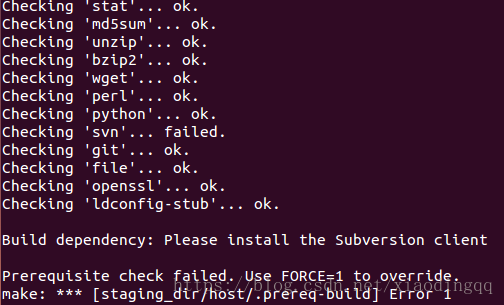

# OpenWrt HelloWorld程序开发入门

1、首先编译生成开发环境，在上一节已经提到（点击这里）

2、首先使用git命令获取源代码并创建SDK目录


3、把现有的helloworld工程拷贝到chaos_calmer/package目录下（如果需要helloworld工程的程序，请点击在这里）

    （可以自己创建目录，输入代码）


3.1 目录 helloworld/Makefile：  

```
include $(TOPDIR)/rules.mk

PKG_NAME:=helloworld
PKG_RELEASE:=1.0

PKG_BUILD_DIR := $(BUILD_DIR)/$(PKG_NAME)
PKG_CONFIG_DEPENDS :=

include $(INCLUDE_DIR)/package.mk
define Package/helloworld
    SECTION:=utils
    CATEGORY:=Utilities
    TITLE:=Hellworld Program
endef

define Package/helloworld/description
    a OpenWrt demo of Hello World .
endef

define Build/Prepare
    mkdir -p $(PKG_BUILD_DIR)
    $(CP) ./src/* $(PKG_BUILD_DIR)/
endef

define Package/helloworld/install
    $(INSTALL_DIR) $(1)/usr/sbin
    $(INSTALL_BIN) $(PKG_BUILD_DIR)/helloworld $(1)/usr/sbin/helloworld
endef

$(eval $(call BuildPackage,helloworld))
```

3.2 目录 helloworld/src/helloworld.c

```
#include <stdio.h>
int main()
{
    printf("hello world ! \t\n");
    return 0;
}
```

3.2 目录 helloworld/src/Makefile

```
CC = gcc
FLAG = -Wall

helloworld:
    $(CC) $(FLAG) helloworld.c -o helloworld
```

4、配置编译：

4.1 回到chaos_calmer目录。

    输入命令：cd /home/sl/chaos_calmer

4.2 输入命令：make menuconfig



如果出现上图情况：Build dependency：Please install the Subversion client

说明你还没有完全安装编译OpenWrt所需的安装包，请输入以下命令：

sudo apt-get install zlib1g-dev gawk flex patch git-core g++ subversion

4.3 请选择Utilities--->选项

    （为什么要选择这个选项？因为在Makefile中提到：CATEGORY:=Utilities）


4.4 在下图选项中，找到helloworld选项，然后输入M或者输入空格，直到尖括号<>里面是M（以模块方式插入内核）


4.5 选择目标文件的系统，选择X86

    （进入Target System 选项，然后只勾选X86选项）


4.6 然后按下右键，选择<Exit>选项，然后再选择<Exit>选项，最后选择<Yes>选项，保存你的新配置

5 编译helloworld应用

5.1 输入命令：

    make package/helloworld/compile V=99

5.2 如果出现下图错误：


```
make[2]: Leaving directory '/home/sl/chaos_calmer/package/libs/toolchain'

make[1]: *** [package/libs/toolchain/compile] Error    2

make[1]: Leaving directory '/home/sl/chaos_calmer'

make: *** [package/helloworld/compile] Error    2
```

说明你没有编译源源码。

输入命令：

make （需要等待３个小时左右，编译过程中需要连接外网）

再make编译过程中，有可能出现以下情况：（因为没有连接外网）

```
make -r world:build failed. Please re-run make with -j1 V=s to see what's going on

make:*** [world] Error 1
```

6 编译完成后，生成helloworld_1.0_x86.ipk安装文件

    这个文件在chaos_calmer/bin/x86/packages/base目录下


7 在OpenWrt虚拟机系统中安装vsftpd

    输入命令：
    
    opkg update
    
    opkg install vsftpd


8 在windows的cmd命令提示符中使用ftp把helloworld_1.0_x86.ipk安装文件上传到OpenWrt虚拟机系统中

8.1 把helloworld_1.0_x86.ipk安装文件拷贝到C:\Users\Administrator目录下

8.2 打开cmd命令提示符，输入ftp192.168.56.2命令（openWrt的ip），然后输入用户名和密码


8.3 输入lcd命令，可查看目前的本地目录

    目前的本地目录 C:\Users\Administrator。

8.4 输入dir命令，可查看服务器（openWrt系统）的当前目录

8.5 上传helloworld_1.0_x86.ipk安装文件到openWrt系统中

    输入命令：put helloworld_1.0_x86.ipk


8.6 使用opkg命令安装helloworld_1.0_x86.ipk文件，并且使用which命令查看helloworld安装在哪里，最后输入helloworld即可看到输出“hello world!”

    输入命令：
    opkg install helloworld_1.0_x86.ipk
    
    which helloworld
    
    helloworld


https://blog.csdn.net/hui523hui523hui523/article/details/38366427

https://blog.csdn.net/jinchengzhou/article/details/46623605

————————————————

版权声明：本文为CSDN博主「mainn」的原创文章，遵循CC 4.0 BY-SA版权协议，转载请附上原文出处链接及本声明。

原文链接：https://blog.csdn.net/xiaodingqq/article/details/80785860
