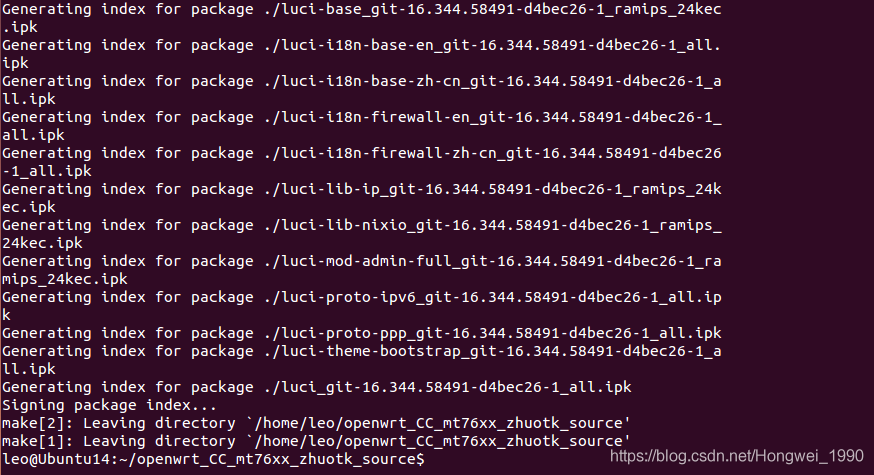
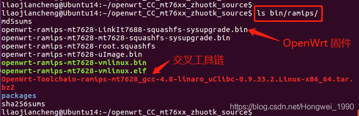
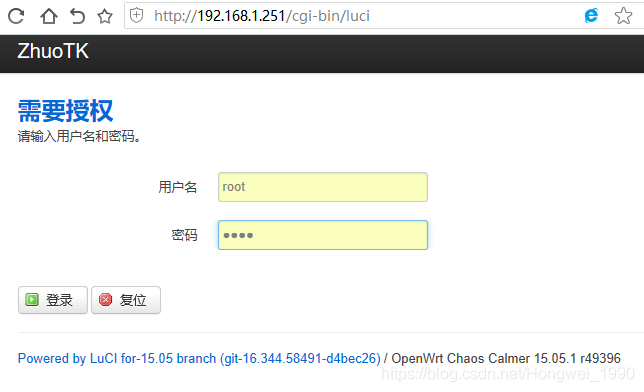

# OpenWrt 开发流程（获取源码，编译源码，刷新固件，安装 交叉工具链，设置 环境变量，修改DTS）

文章目录

```
1、搭建 OpenWrt 开发环境
	1.1 配置 编译环境
	1.2 获取 JS7628 配套的 OpenWrt 源码
	1.3 make menuconfig 配置系统功能
		1.3.1 关于 `IOT-device`、`IOT-gateway` 模式的配置
	1.4 编译 OpenWrt 源码（make V=s）
2、刷新 OpenWrt 固件
	2.1 备份/升级
	2.2 刷新固件
	2.3 执行
3、生成 交叉工具链（Toolchain）
4、安装 交叉工具链（Toolchain）
	4.1 解压 交叉工具链 压缩包（/opt）
	4.2 设置 环境变量（export PATH）
	4.3 检查是否 安装成功（mipsel-openwrt-linux-gcc -v）
5、配置 JS7628 开发板硬件默认功能（修改DTS）
	5.1 修改支持的 内存 大小
	5.2 修改支持的 Flash 大小
	5.3 配置 管脚复用 功能
6、验证 IOT-gateway 功能（路由器相似）
```

## 1、搭建 OpenWrt 开发环境 ##

**1.1 配置 编译环境**

为了能正常的编译 OpenWrt 源码，我们需要在 Ubuntu 系统中安装一些软件。打开一个终端，在 Ubuntu 终端下面 输入命令：

```
sudo apt-get install subversion build-essential libncurses5-dev zlib1g-dev gawk git ccache gettext libssl-dev xsltproc
```


```
序号    包名    描述
1    build-essential    -
2    libncurses5-dev    -
3    zlib1g-dev    -
4    gawk    -
5    git    开源的分布式版本控制系统
6    subvision    -
7    ccache    -
8    gettext    -
9    libssl-dev    -
10    xsltproc    -
```

注意：如果未完全安装以上软件，可能会造成编译 OpenWrt 源码时出错，请务必安装完全。

**1.2 获取 JS7628 配套的 OpenWrt 源码**

在 JS7628 开发板配套资料\JS7628 开发板源码\openwrt 源码\openwrt_CC_mt76xx_zhuotk_source_20170112.tar.bz2 里面已经提供了下载好的 OpenWrt 源码，此源码已经更新了 安装包，根据 JS7628 开发板功能进行了修改。

将该安装包拷贝到当前登录 Ubuntu 的【用户的工作目录】（即 /home/leo 目录下），切换到 /home/leo 目录下并且 操作：

```
序号    操作    描述
1    tar xjvf openwrt_CC_mt76xx_zhuotk_source_20170112.tar.bz2 -C ./    解压源码包 到当前目录（./）
2    cd openwrt_CC_mt76xx_zhuotk_source    进入源码目录（source）
3    ./scripts/feeds install -a    安装更新的软件包
提示：这个源码编译出来的 OpenWrt 固件可以在 JS7628 开发板上正确运行。
```

**1.3 make menuconfig 配置系统功能**

OpenWrt 也具有像经典的 Linux 的 make menuconfig 功能，用户用一种熟悉的方式对 OpenWrt 系统功能进行配置。
获取到 OpenWrt 源码 后，我们在 OpenWrt 源码 根目录下输入以下命令：

    make menuconfig

效果如图所示：


上图的这个界面，对于之前做 Linux 开发的人员来说，应该是感觉很熟悉了。在这里，可以对 OpenWrt 的各种功能进行配置，包括 选择【芯片平台】、选择各种各样功能的【安装包】、生成【交叉工具链】等等，非常多。

```
序号    按键操作    描述
1    <Enter>    选择 子菜单 --->
2    <Y>    include，包含（勾选）
3    <N>    exclude，不包含（取消勾选）
4    <M>    modularizes features，模块化功能
5    <Esc><Esc>    退出
```

说明：[*] built-in

**1.3.1 关于 IOT-device、IOT-gateway 模式的配置**

进入到菜单：

```
Kernel modules —>
Other modules —>
< > kmod-sdhci-mt7620
```

```
序号    选择    描述
1    如果 选上kmod-sdhci-mt7620    开发板支持 micro SD 卡接口功能，同时启用IOT-device功能
2    如果 选择 不启用    则开发板不支持 micro SD 卡接口功能，并启用IOT-gateway功能
```

**1.4 编译 OpenWrt 源码（make V=s）**

切换到 OpenWrt 源码 根目录下，输入以下命令：

    make V=s

编译源码，V=s 是用来生成编译信息的，方便用户查找出错原因。

接下来就是漫长的等待，少则 2-3 个小时，多则 1-2 天。耗时在于 OpenWrt 系统要下载各种各样的 源文件安装包，编译 Linux 内核，生成交叉工具链，生成各种工具，生成文件系统等，工作量非常大（不用担心，这一切都是它自动完成的）。其中最耗时也最容易出错的就是下载各种 源码包 了，因为这些源码包绝大部分都是从国外下载的，所以速度很慢，而且非常容易出现无法下载的情况，最终导致 OpenWrt 编译报错。

提示：在 JS7628 开发板配套资料\JS7628 开发板源码\openwrt 源码\dl 下，已经将这些需要下载的 源码包 下载好了，只需要将里面的文件拷贝到 Ubuntu 里面的 openwrt 源码根目录\dl 下即可。

最后，编译成功会出现类似下图的提示：



编译完成后的 JS7628 的 OpenWrt 固件 openwrt-ramips-mt7628-mt7628-squashfs-sysupgrade.bin 可以在 openwrt/bin/ramips/ 下找到：


IPK 安装包 在 openwrt/bin/ramips/packages/ 目录下，如图所示：


以下 3个文件夹均放有 IPK 安装包：

```
序号    文件夹    描述
1    base    存放 系统基本的安装包
2    luci    存放 LuCI网页相关的安装包
3    packages    存放 其他很多的功能安装包
```

## 2、刷新 OpenWrt 固件 ##

**2.1 备份/升级**


**2.2 刷新固件**
（1）如果 勾选 “保存配置”，则系统在刷新固件后，系统的会根据 “配置” 里面的路径，保持里面的文件不变，系统会更新内核。
（2）如果 去掉 “保存配置”，刷新后，将是一个全新的系统。此时也可以利用之前的 “恢复配置” 恢复系统。

在随后跳出的文件选择页面中，选中要上传的 固件，并单击 “打开”，如下图所示：


**2.3 执行**


## 3、生成 交叉工具链（Toolchain） ##

用户如果想自己编译获得 OpenWrt 的交叉工具链，只需要在 OpenWrt 的 menuconfig 顶层配置界面中，勾选上 Build the OpenWrt based Toolchain，如下图所示：


然后 保存退出，再次 make V=s，生成的 交叉工具链 将在 openwrt 源码目录/bin/ramips/OpenWrt-Toolchain-ramips-mt7628_gcc-4.8-linaro_uClibc-0.9.33.2.Linux-x86_64.tar.bz2 下找到。



（提示：不方便编译的用户，可以在 JS7628 开发板配套资料\ JS7628开发板固件镜像安装包\ 交叉工具链 中找到编译好的 Openwrt 交叉工具链，可以直接拿来使用）

## 4、安装 交叉工具链（Toolchain） ##

OpenWrt 交叉工具链 和 一般的 Linux 软件包一样，需要将其 解压 到需要安装的目录中，然后设置 环境变量 即可。下面是安装步骤：

**4.1 解压 交叉工具链 压缩包（/opt）**

将 交叉工具链 安装到 Ubuntu 的 /opt 目录下。首先切换到 OpenWrt 的 根目录 下，输入如下命令：

```
sudo tar xjvf ./bin/ramips/OpenWrt-Toolchain-ramips-mt7628_gcc-4.8-linaro_uClibc-0.9.33.2.Linux-x86_64.tar.bz2 -C /opt/
```

将 交叉工具链 压缩包 解压 到 Ubuntu 系统的 /opt/ 目录下。

**4.2 设置 环境变量（export PATH）**

执行命令：

    sudo vi /etc/bash.bashrc

在文件最后添加以下 两行配置：

```
export PATH=/opt/OpenWrt-Toolchain-ramips-mt7628_gcc-4.8-linaro_uClibc-0.9.33.2.Linux-x86_64/toolchain-mipsel_24kec+dsp_gcc-4.8-linaro_uClibc-0.9.33.2/bin:$PATH
export STAGING_DIR=/home/leo/openwrt_CC_mt76xx_zhuotk_source/staging_dir
```

效果如下：


上面这个 STAGING_DIR 变量中的 /home/leo/openwrt_CC_mt76xx_zhuotk_source/ 是开发者 实际放 OpenWrt 源码 的 根目录。如果这个 STAGING_DIR 变量不设置的话，会在用 交叉工具链 编译文件时有警告，但是 不影响编译结果。保存退出。

最后，让环境变量 生效 的命令：

    source /etc/bash.bashrc


**4.3 检查是否 安装成功（mipsel-openwrt-linux-gcc -v）**

输入以下命令：

    mipsel-openwrt-linux-gcc -v

此时应打印出 交叉编译工具 的一些信息，表示 安装成功，如下图所示：


如果是出现：“mipsel-openwrt-linux-gcc -v 未找到命令” 可能是环境变量的路径设置错误：
例如：“处理器架构” 选择错误，比如"opt/OpenWrt-Toolchain-ramips-mt7628_gcc-4.8-linaro_uClibc-0.9.33.2.Linux-x86_64"
写成"/opt/OpenWrt-Toolchain-ramips-mt7628_gcc-4.8-linaro_uClibc-0.9.33.2.Linux-i686/"

## 5、配置 JS7628 开发板硬件默认功能（修改DTS） ##

在 OpenWrt 系统源码里面，采用 MTK（联发科）芯片的板子硬件配置文件 DTS（Device tree source：设备树）一般都放在 openwrt 源码/target/linux/ramips/dts/ 目录下，如下图所示：

    ls target/linux/ramips/dts


打开这个 MT7628.dts 文件，我们可以看到 JS7628 开发板相关的 硬件配置信息，如下所示：


**5.1 修改支持的 内存 大小**

JS7628 开发板有 3 种内存配置，分别是 64MB、128MB、256MB，可以在这个 DTS 文件大约第 16~18 行找到这个配置：


根据后面的注释，自行去掉对该行的注释然后启用这个内存配置，重新编译出固件。

注意：选择和硬件不匹配的配置，可能会导致系统运行不正常。

**5.2 修改支持的 Flash 大小**

找到大约第 123~125 行：


根据后面的注释，自行去掉对该行的注释然后启用这个 Flash 配置，重新编译出固件。

注意：选择和硬件不匹配的配置，可能会导致系统运行不正常。

**5.3 配置 管脚复用 功能**

MT7628 芯片里面有很多管脚是复用，这里我们以 spis 功能为例做介绍如何配置 JS7628 开发板的管脚功能复用。
找到大约第 49 行：


从上图可以看出MT7628芯片的SPIS管脚默认配置为 pwm_uart2 功能，具体可以配置哪几种功能是在OpenWrt 源码目录 openwrt/build_dir/target-mipsel_24kec+dsp_uClibc-0.9.33.2/linux-ramips_mt7628/linux-3.18.29/arch/mips/ralink/mt7620.c 中定义的，打开该文件找到下图所示行：


由上图可知，我们可以把 spis 管脚组定义为 pwm_uart2、util、gpio、spis 4种功能，这个和 MT7628 的 datasheet
（JS7628 开发板配套资料\芯片元器件手册\MT7628\MT7628 Datasheet.pdf）中介绍的完全对应，如下图所示：


如果需要将这几个管脚恢复为 GPIO功能，可以把 DTS 文件修改为：


然后重新编译固件烧录，这样这组管脚就变成了 GPIO 功能。其他组管脚和这里介绍的方法大同小异，请自行测试。

## 6、验证 IOT-gateway 功能（路由器相似） ##

JS7628的WAN口连接路由器（连接互联网），LAN口连接计算机。计算机也可以上网，IP地址 192.168.1.239，默认网关IP是 192.168.1.251。

计算机的浏览器 输入网关IP 192.168.1.251，回车。登录JS7628，这里账号密码都是root，单击登录。




————————————————

版权声明：本文为CSDN博主「deepwater_zone」的原创文章，遵循CC 4.0 BY-SA版权协议，转载请附上原文出处链接及本声明。

原文链接：https://blog.csdn.net/Hongwei_1990/article/details/97616898
