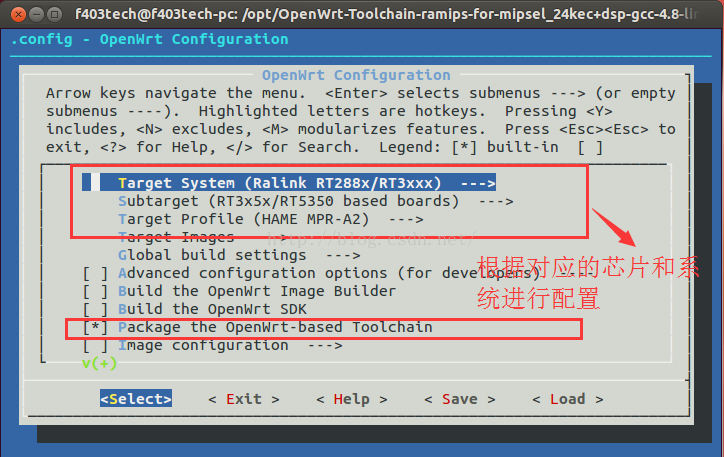
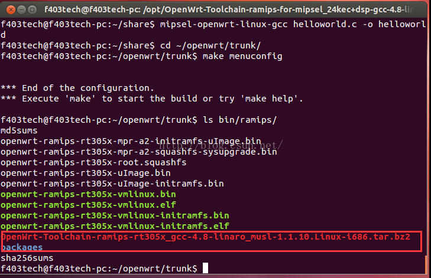
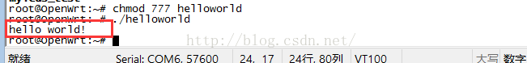

# openwrt 构建交叉编译工具

假设已经下载好了openwrt ，我使用的是从SVN下载的trunk版本的openwrt 其他版本可能略有不同

首先进入openwrt/trunk 目录 进行配置，配置方式

    make menuconfig



配置目标系统 ，选择编译toolchain 如上图所示。保存配置，并退出

或者直接在.config 添加`CONFIG_MAKE_TOOLCHAIN=y`

进行编译

    make V=99

编译完成后,输入

    ls bin/ramips/



红色方框就是编译出来的交叉编译工具。

将交叉编译工具解压到/opt/目录下

```
sudo tar -jxvf OpenWrt-Toolchain-ramips-rt305x_gcc-4.8-linaro_musl-1.1.10.Linux-i686.tar.bz2 -C /opt/
```

进入 /opt/OpenWrt-Toolchain-ramips-rt305x_gcc-4.8-linaro_musl-1.1.10.Linux-i686/toolchain-mipsel_24kec+dsp_gcc-4.8-linaro_musl-1.1.10/bin 目录 执行

```
vi mipsel-openwrt-linux-musl-wrapper.sh
```

找到TOOLCHAIN_BIN_DIR="$REALNAME_DIR/"

在下面添加

```
export STAGING_DIR="$REALNAME_DIR/../../"
```

否则编译的时候会出现STAGING_DIR 警告

为了使用方便，我们再设置一下全局变量

```
sudo vi /etc/profile
```

在文件末尾加入

```
export PATH=$PATH:/opt/OpenWrt-Toolchain-ramips-rt305x_gcc-4.8-linaro_musl-1.1.10.Linux-i686/toolchain-mipsel_24kec+dsp_gcc-4.8-linaro_musl-1.1.10/bin
```

这里可能不同版本的路径会不一样，注意修改

生效环境变量

```
source /etc/profile
```

验证交叉编译工具是否安装成功

```
 mipsel-openwrt-linux-
```

输入以上指令，并双击tab键两下，可以看到如下所示

接着我们编写简单helloworld 程序进行测试

程序如下

```
#include "stdio.h"
int main()
{
        printf("hello world!\r\n");
}
```

再执行gcc 编译

```
mipsel-openwrt-linux-gcc helloworld.c -o helloworld
```

将helloworld 传到开发板执行



————————————————

版权声明：本文为CSDN博主「另一章翻开」的原创文章，遵循CC 4.0 BY-SA版权协议，转载请附上原文出处链接及本声明。

原文链接：https://blog.csdn.net/lingyizhangfankai/article/details/47007811
